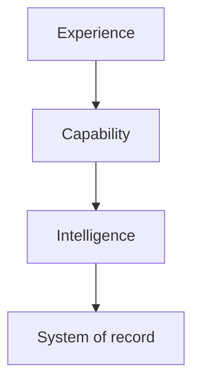

# Architecture Principles

## 1. Modernize through the work

Choose real operational problems and solve them in ways that leave reusable capabilities behind. Avoid both indefinite platform-first programs and isolated prototypes that create no platform value.

## 2. Preserve authority boundaries

- Models perceive and generate probabilistic output.
- Systems of record provide authoritative operational facts.
- Governed knowledge and rules provide current standards.
- Agents reason and orchestrate across approved capabilities.
- Deterministic controls and authorized humans govern consequential action.

Perception is not policy. Retrieved knowledge is not deterministic enforcement. Agent memory is not a system of record.

## 3. Organize from experience to record

Applications should invoke stable business capabilities. Intelligence operates behind those contracts. Integration details and legacy mechanics remain below the agent and user experience.

## 4. API-first, MCP-ready

Business operations must have stable, testable contracts independent of any one agent runtime. MCP may expose selected capabilities for portable discovery and invocation, but it does not own business logic, transaction integrity, or the authoritative record.

## 5. Thin clients, capable services

Mobile and web clients capture intent and evidence, display structured results, support constrained offline operation, and gather human corrections. Core reasoning, policy, integration, and secrets remain server-side.

## 6. Least capability necessary

Agents receive curated tools appropriate to a bounded task. Read, assess, explain, and propose are preferred before direct write or destructive actions. High-impact actions require deterministic validation, explicit authorization, approval, and audit.

## 7. Structured contracts over prose coupling

Service and agent outputs use versioned structured schemas. Human-readable explanation complements, but does not replace, machine-verifiable fields, status codes, provenance, confidence, and required follow-up.

## 8. Evaluation is part of the product

Golden cases, error taxonomies, safety tests, tool-call validation, latency, cost, and human-review outcomes are versioned with the capability. A demo is evidence of possibility; an evaluation is evidence of fitness.

## 9. Security and observability are architecture

Identity, authorization, private connectivity, secrets, logging, trace correlation, data classification, retention, and operational ownership are designed with the capability—not attached after implementation.

## 10. Prefer reversible decisions

Keep domain services independent from models, agent runtimes, and publication platforms. Use adapters at volatile boundaries. Record irreversible commitments and migration paths through ADRs.

