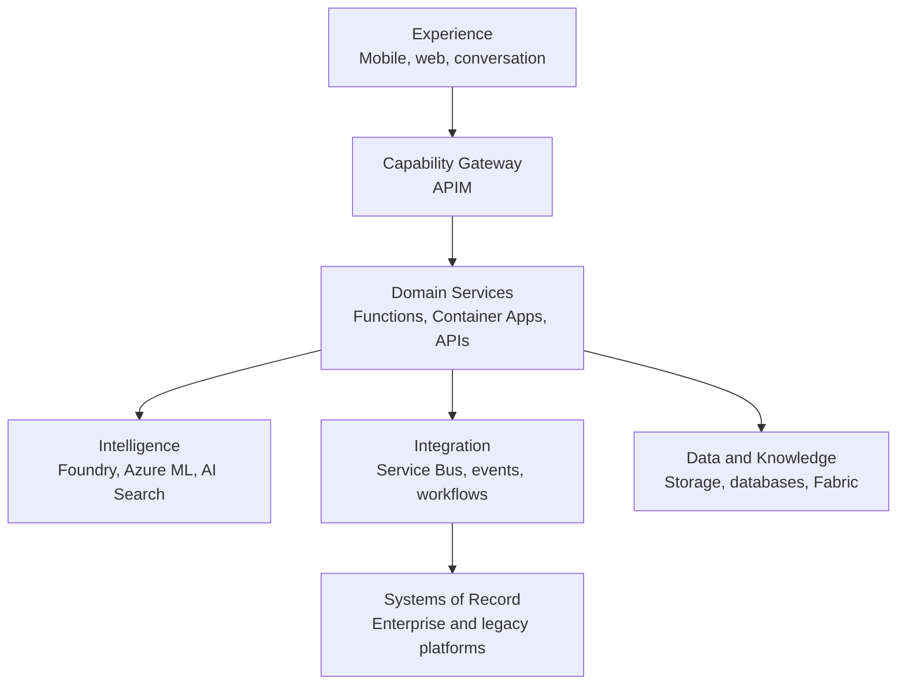

# Platform Map

The Product Group platform is organized by responsibility rather than by Azure product name. Services may participate in multiple layers, but each workload must identify which responsibility each service fulfills.

Identity, network controls, policy, secrets, monitoring, audit, cost management, and documentation apply across every layer.

This map is a responsibility model, not a claim that every listed Azure service is licensed, deployed, approved, or required. A workload may use more than one compute or integration service, but each component still needs one accountable owner and an explicit operational boundary.

## Responsibility map

| Responsibility | Primary Azure capabilities | Required design question |
|---|---|---|
| User experience | Mobile/web frameworks, Static Web Apps, App Service, Front Door | What must remain usable during poor connectivity? |
| Capability gateway | API Management | Which stable business capabilities are externally callable? |
| Compute and orchestration | Functions, Container Apps, Logic Apps, Durable Functions | Is the work event-driven, long-running, containerized, or integration-heavy? |
| Agentic intelligence | Microsoft Foundry Agent Service, Toolboxes, model catalog | What bounded decisions and tools belong to the agent? |
| Custom ML | Azure Machine Learning | Does the task require training, registry, managed endpoints, or controlled MLOps? |
| Retrieval and knowledge | Azure AI Search, governed source repositories | What evidence is retrieved, filtered, cited, and refreshed? |
| Data | Blob/ADLS, Azure SQL, PostgreSQL, Cosmos DB, Fabric/OneLake | What is authoritative, operational, analytical, or derived? |
| Integration | Service Bus, Event Grid, Event Hubs, Data Factory, APIs | Is the interaction a command, event, stream, batch, or query? |
| Security | Entra ID, managed identity, RBAC, Key Vault, Private Link | Who or what is calling, and what is the least authority required? |
| Operations | Azure Monitor, Application Insights, Log Analytics | Can a support team trace one business transaction end to end? |
| Governance | Azure Policy, Defender for Cloud, Purview, API Center | Can the organization discover, classify, approve, and control the asset? |

## Control-plane distinction

- **Azure Resource Manager:** controls Azure resource deployment and configuration.
- **Foundry control plane:** manages AI projects, models, agents, evaluations, connections, and related runtime assets.
- **Product control plane:** contains the Product Group's own configuration, feature flags, approved prompts, tool selection, and release metadata.
- **Data plane:** carries operational calls, messages, images, records, search queries, and inference traffic.

Product documentation must explicitly identify which plane a configuration belongs to. Secrets and identifiers should not drift into prompts or source documentation.

## Current Microsoft qualifications

- Microsoft treats its compute decision guidance as a starting point; each workload component must be evaluated separately, and a solution can use more than one compute service.
- Azure API Center provides design-time inventory and discovery. Azure API Management provides runtime gateway governance and observability. Neither substitutes for the other.
- Azure landing-zone guidance separates centrally governed platform capabilities from workload-owned application landing zones. The enterprise subscription, management-group, and shared-service model remains unknown.
- An anti-corruption layer can isolate modern domain semantics from legacy schemas, protocols, and APIs; APIM or Functions can help implement the boundary, but the pattern doesn't prescribe a product.

Research detail and unresolved enterprise facts are recorded in [Source Record — Architecture, Integration, and Application Platform](../sources/2026-09-19-architecture-integration-application.md).
