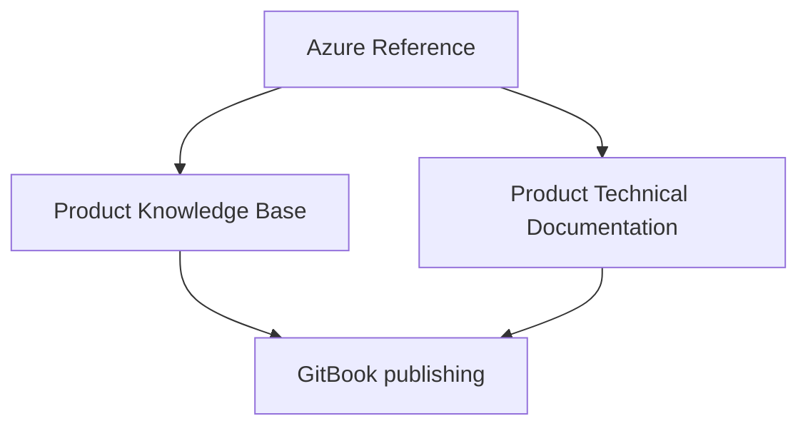

# Product Group Azure Reference

This repository is the Product Group's durable reference for designing, governing, delivering, and operating products on Microsoft Azure.

It has three jobs:

1. Explain the Azure capabilities applicable to the Product Group.
2. Define the approved architectural patterns and decision boundaries for using them.
3. Supply controlled source material from which product Knowledge Base and Technical Documentation are derived.

This is not a product requirements repository, a copy of Microsoft Learn, a licensing ledger, or an implementation runbook for one application. It is the shared platform reference from which those artifacts inherit.

## Governing position

> Modernize through the work. Solve today's operational problems in ways that create tomorrow's platform.

The reference applies these companion principles:

- Technology should serve the flow of work.
- Experience calls capabilities; capabilities use intelligence; systems of record preserve authority.
- Models perceive. Knowledge and rules provide standards. Agents reason and orchestrate. Humans and deterministic controls authorize consequential action.
- Intelligence recommends. Authority decides. Systems record.
- API-first underneath. MCP-ready at the edge. Governed throughout.
- The phone captures and displays. The service thinks.
- Build reusable capabilities, not one giant intelligent system.

## Documentation flow

- **Azure Reference:** platform facts, approved patterns, service-selection guidance, controls, and source provenance.
- **Knowledge Base:** audience-oriented explanations, concepts, FAQs, and operational guidance.
- **Technical Documentation:** product-specific architecture, contracts, deployment, operations, troubleshooting, and support evidence.
- **GitBook:** publication layer, not the source of architectural truth.

Start with [Purpose, Scope, and Boundaries](00-governance/purpose-scope.md), then use [Platform Map](01-architecture/platform-map.md) and [Service Selection](01-architecture/service-selection.md).

## Repository controls

- Each page declares status, owner, review date, and source posture.
- Microsoft Learn remains authoritative for Microsoft product behavior.
- This repository is authoritative for Product Group interpretation, selection, and approved patterns.
- Tenant-specific facts, licensing, SKUs, endpoints, owners, and support commitments are deliberately recorded during transition using the [Transition Run Guide](09-transition/transition-run-guide.md).
- Product-specific facts belong downstream, linked back to the relevant reference page.

